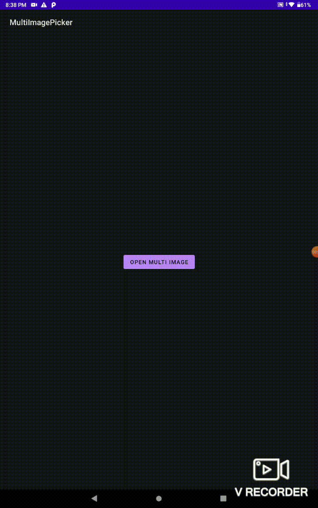

# MultiImagePicker
[](https://jitpack.io/#chintan369/MultiImagePicker)

This library allows to select multiple image selection option in Android to select device images rather than selecting a single image from Gallery intent.

This library provides a simple implementation to call Gallery intent for multiple image selection as well as easy to get the result in Uri list. You can also request the absolute filepath instead of Uri in response.

## Add Dependency
Use Gradle:

**Step 1:** Add it in your root _`build.gradle`_ at the end of repositories:
```gradle
allprojects {
    repositories {
      ...
      maven { url 'https://jitpack.io' }
    }
}
```

**Note:** In New Android studio updates, now `allProjects` block has been removed from root `build.gradle` file. So you must add this repository to your root _`settings.gradle`_ as below:
```gradle
dependencyResolutionManagement {
  repositoriesMode.set(RepositoriesMode.FAIL_ON_PROJECT_REPOS)
  repositories {
      ...
      maven { url "https://jitpack.io" }
  }
}
```

**Step 2:** Add the dependency in your module's (e.g. app or any other) _`build.gradle`_ file:
```gradle
dependencies {
    ...
    implementation 'com.github.chintan369:MultiImagePicker:<latest-version>'
}
```

or use Maven:
```xml
<repositories>
    <repository>
        <id>jitpack.io</id>
        <url>https://jitpack.io</url>
    </repository>
</repositories>

<dependency>
    <groupId>com.github.chintan369</groupId>
    <artifactId>MultiImagePicker</artifactId>
    <version>latest-version</version>
</dependency>
```

## How do I use MultiImagePicker?
In your `Activity` or `Fragment`, wherever you want to call the multiple image selection, call `MultiImagePicker` as below with your selection limit configuration:

### Requesting to select images
Using Java / Kotlin:
```kotlin
    MultiImagePicker.with(this) // `this` refers to activity or fragment
          .setSelectionLimit(10)  // The number of max image selection you want from user at a time, MAX is 30
          .open() // This will open image selection activity to select images
```

**Note:** Even if you will set selection limit to  `< 1` or `> 30`, MultiImagePicker will set the limit to `30` by default and continue.

### Handle Result after images selection
When user has completed with images selection and clicks `Done`, MultiImagePicker will come back to the calling `Activity` or `Fragment` and returns the result in `onActivityResult` method.

In `onActivityResult(requestCode, resultCode, data)` method, handle the result and get the selected image list either in Uri list or in absolute filepath list:

Using Kotlin:
```kotlin
override fun onActivityResult(requestCode: Int, resultCode: Int, data: Intent?) {
    super.onActivityResult(requestCode, resultCode, data)
    ...
    if (requestCode == MultiImagePicker.REQUEST_PICK_MULTI_IMAGES && resultCode == RESULT_OK) {
        val result = MultiImagePicker.Result(data)
        if (result.isSuccess()) {
            val imageListInUri = result.getImageList() // List os selected images as content Uri format
            //You can also request list as absolute filepath instead of Uri as below
            val imageListInAbsFilePath = result.getImageListAsAbsolutePath(context)
            
            //do your stuff from the selected images list received
        }
    }
}
```

or using Java:
```java
protected void onActivityResult(int requestCode, int resultCode, Intent data) {
    super.onActivityResult(requestCode, resultCode, data)
    ...
    if (requestCode == MultiImagePicker.REQUEST_PICK_MULTI_IMAGES && resultCode == RESULT_OK) {
        MultiImagePicker.Result result = new MultiImagePicker.Result(data)
        if (result.isSuccess()) {
            ArrayList<Uri> imageListInUri = result.getImageList() // List os selected images as content Uri format
            //You can also request list as absolute filepath instead of Uri as below
            ArrayList<String> imageListInAbsFilePath = result.getImageListAsAbsolutePath(context)
            
            //do your stuff from the selected images list received
        }
    }
}
```

## Demo



That's pretty simple to use and enjoy the library!

If you requires more features and customization on this library, Create an issue with title prefix - "Requires feature/customization - ".

Also for my work, if you liked it, then you can Buy me a Coffee from here:

<a href="https://www.buymeacoffee.com/chintan369" target="_blank"></a>


